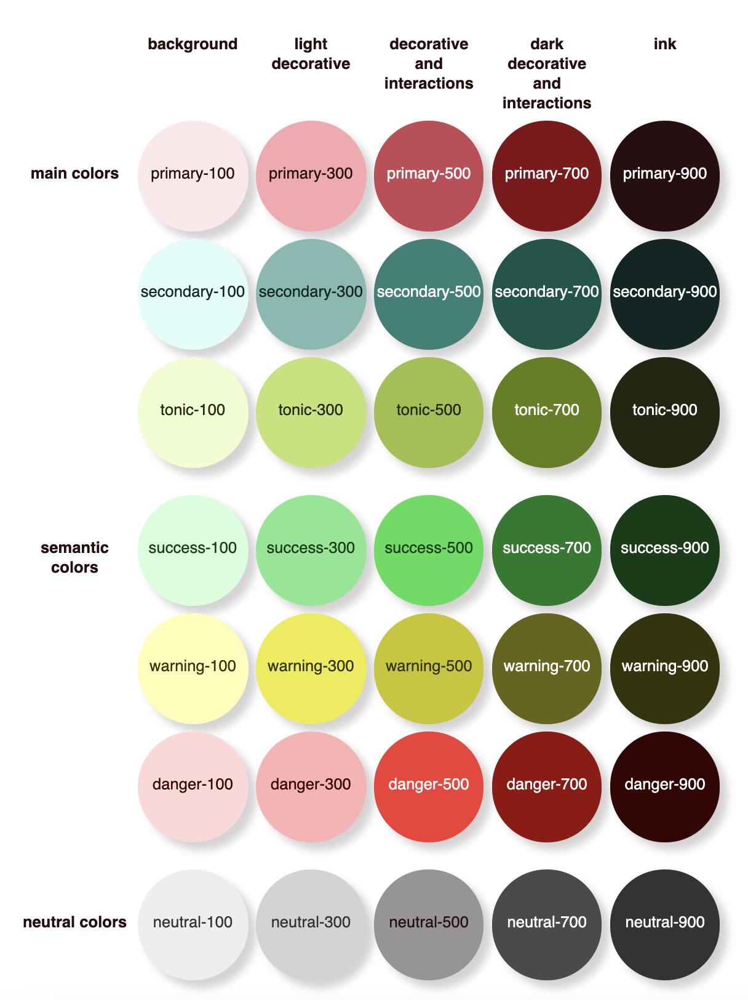

# Learn@Home - Mai 2021

Documentation correspondant au **Projet 10 - _Définissez les besoins pour une app de soutien scolaire_** du parcours **Développeur Front-end** d'_OpenClassrooms_.

## Objectif

Concevoir et documenter les futures fonctionnalités d'une **application web pour l'association _Learn@Home_**.

Cette _web app_ a pour but d'offrir aux élèves et tuteurs les fonctionnalités suivantes :

- s'authentifier
- voir son tableau de bord personel
- tchatter
- consulter son calendrier
- gérer ses tâches et, pour les tuteurs, les tâches de ses élèves

## Eléments d'UI

### Palette de couleurs complète

**N.B. :** Les codes hexa des couleurs de cette palette sont regroupés dans un [fichier SCSS](./css/scss/abstracts/_variables.scss).
